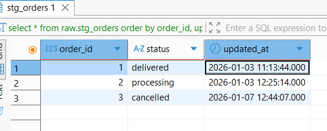
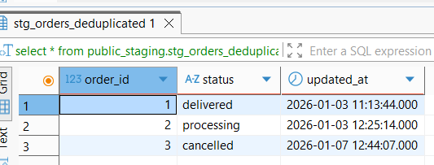
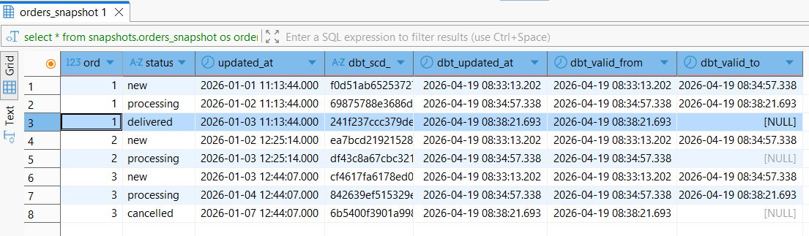
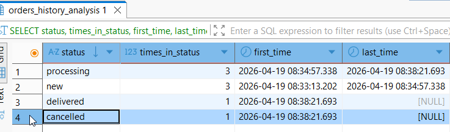
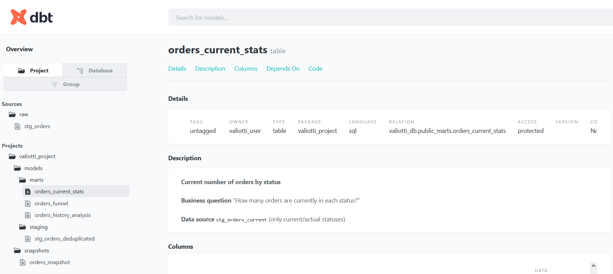

# Историзация статусов заказов (SCD Type 2)

dpt модель:
 - источник raw.stg_orders (сохраняет только текущее состояние заказа)
   
 
 
 - сделан слой staging (очистка данных от повторов)
   
 
 
 - сделан снепшот для сохранения истории по дате обновления
   
 
 
 - созданы дата март (материализация табл) как для текущего состояния (источник вью без дубликатов), так и для история (источник снепшот)
   

 Сгенерирована документация
 
